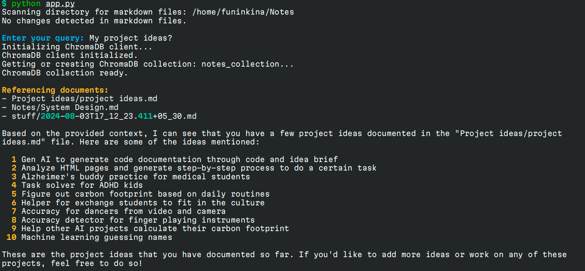

# QueryMD
## Ask and query your markdown notes using AI



It uses ChromaDB as a vector database to store the embeddings of your notes and Groq AI interface to query them. Embeddings are generated using ChromaDB's built-in embedding model - SentenceTransformer.

## Installation
### 1. Clone the repository
```bash
git clone https://github.com/funinkina/QueryMD
```
### 2. Create a python virtual environment
Recommended Python version is 3.11
```bash
cd QueryMD
python -m venv .venv
source .venv/bin/activate
```
### 3. Install the requirements
```bash
pip install -r requirements.txt
```
### 4. Configure your config.toml
Can be used as it is, just change the `markdown_directory` to the path of your markdown files.,
```toml
[embeddings]
model_name = "all-MiniLM-L6-v2"
collection_name = "notes_collection"
embeddings_path = "./embeddings"

[files]
markdown_directory = "</path/to/your/markdown/files>"
```

### 5. Set up your environment variables
You need a Groq API key to use the Groq AI interface. You can get one from [here](https://console.groq.com/keys). And put it in `.env`
```bash
GROQ_API_KEY=<your_groq_api_key>
```

## Usage
### 1. Run the script to create the embeddings
```bash
python create_embeddings.py
```
### 2. Run the script to query the embeddings
```bash
python query_embeddings.py
```
It will ask you for a query. You can enter any keyword or phrase related to your notes. It will return the most relevant notes based on the query.

## TODO
- [ ] Build a TUI for easy access
- [ ] Native Linux Package
- [ ] Better query results
- [ ] Better embeddings model
- [ ] Improve Documentation